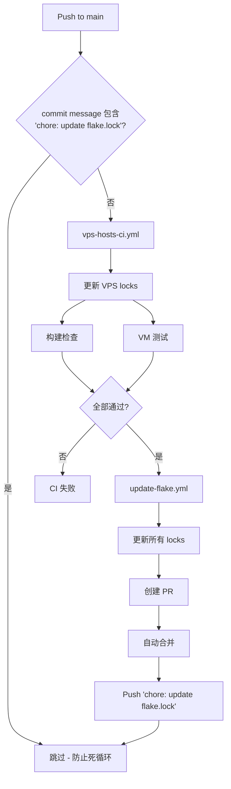

# NixOS Configuration Library

> **Note**: 这是一个可复用的 NixOS 模块库，包含了基础系统、硬件、应用服务的模块化配置。

这是一个基于 **GitOps** 理念设计的 NixOS 配置仓库，采用 **模块化架构** 设计，旨在实现：

1. **完全的所有权**: 你拥有自己的 Git 仓库作为唯一真理源 (Source of Truth)
2. **云端构建**: 使用 GitHub Actions 构建系统镜像和验证配置，无需本地强大的机器
3. **自动交付**: 每日自动更新依赖，VPS 自动拉取最新配置并平滑升级
4. **模块化复用**: 模块库 + 独立主机配置，灵活组合

---

## 架构设计

本仓库采用 **Core + Extra** 分层架构：

```
nixos-config/
├── flake.nix              # 🔗 聚合入口 (整合 core + extra)
├── core/                  # 📦 核心模块库
│   ├── flake.nix          # Core 模块入口
│   ├── app/               # 应用服务模块 (nginx, alist, x-ui 等)
│   ├── base/              # 基础系统模块 (SSH, 时区, 自动更新等)
│   ├── hardware/          # 硬件配置模块 (磁盘分区, 网络等)
│   └── kernel/            # XanMod 内核模块
├── extra/                 # 🧪 扩展模块 (需要外部依赖)
│   └── kernel/
│       ├── cachyos/           # CachyOS 稳定内核 (需要 chaotic)
│       │   ├── flake.nix
│       │   ├── default.nix
│       │   └── sysctl.nix
│       └── cachyos-unstable/  # CachyOS 不稳定内核
│           ├── flake.nix
│           └── default.nix
├── vps/                   # 🖥️ 独立主机配置
│   ├── tohu/              # tohu 主机 (独立 flake)
│   │   ├── flake.nix
│   │   └── facter.json
│   └── hyperv/            # hyperv 主机 (独立 flake)
│       ├── flake.nix
│       └── facter.json
└── docs/                  # 📖 文档
```

### 核心概念

#### 1. 根目录 Flake (`flake.nix`)

根目录 `flake.nix` 作为 **聚合入口**，整合 `core` 和 `extra` 模块：

| 模块名 | 描述 |
|--------|------|
| `nixosModules.default` | 核心模块 (app + base + hardware)，不含内核 |
| `nixosModules.kernel-xanmod` | XanMod 内核 (无需额外 overlay) |
| `nixosModules.kernel-cachyos` | CachyOS 稳定内核 + chaotic 缓存 |
| `nixosModules.kernel-cachyos-unstable` | CachyOS 不稳定内核 + 完整 chaotic overlay |
| `nixosModules.full-xanmod` | 完整预设: core + XanMod |
| `nixosModules.full-cachyos` | 完整预设: core + CachyOS |
| `nixosModules.full-cachyos-unstable` | 完整预设: core + CachyOS Unstable |

#### 2. CI 集成测试

根目录 Flake 还提供三种内核配置的 VM 测试：

```bash
# 运行所有测试
nix flake check

# 运行单个内核测试
nix build .#checks.x86_64-linux.kernel-xanmod
nix build .#checks.x86_64-linux.kernel-cachyos
nix build .#checks.x86_64-linux.kernel-cachyos-unstable
```

#### 3. 主机配置 (`vps/<hostname>/flake.nix`)

每个主机都有独立的 `flake.nix`，通过 GitHub URL 引用模块库：

```nix
{
  inputs = {
    nixpkgs.url = "github:nixos/nixpkgs/nixos-unstable-small";
    lib-core.url = "path:../../core";
    lib-core.inputs.nixpkgs.follows = "nixpkgs";
    
    # 如果使用 CachyOS 内核
    cachyos.url = "path:../../extra/kernel/cachyos-unstable";
    cachyos.inputs.nixpkgs.follows = "nixpkgs";
  };
  
  outputs = { self, nixpkgs, lib-core, cachyos, ... }: {
    nixosConfigurations.<hostname> = nixpkgs.lib.nixosSystem {
      modules = [
        lib-core.nixosModules.default       # 核心模块
        cachyos.nixosModules.default        # CachyOS 内核
        # ... 主机特定配置
      ];
    };
  };
}
```

---

## 模块功能详解

### 📦 `core/base/` - 基础系统模块

| 选项 | 类型 | 默认值 | 描述 |
|------|------|--------|------|
| `core.base.enable` | bool | false | 启用基础系统配置 (SSH, 时区, 国际化等) |
| `core.base.update.enable` | bool | false | 启用自动更新和垃圾回收 |
| `core.base.update.allowReboot` | bool | false | 更新后允许自动重启 |
| `core.base.update.flakeUri` | string | `github:ShaoG-R/nixos-config?dir=vps/${hostname}` | 自动更新的 Flake 源 |

**子模块:**
- `auth.nix` - SSH 认证配置 (密钥/密码登录)
- `container.nix` - 容器运行时 (Podman)
- `dns/smartdns.nix` - SmartDNS 配置
- `memory.nix` - 内存优化 (zram, earlyoom)
- `performance/tuning.nix` - 性能调优

### 📦 `core/hardware/` - 硬件配置模块

| 选项 | 类型 | 默认值 | 描述 |
|------|------|--------|------|
| `core.hardware.type` | enum | "physical" | 硬件类型: `physical` (物理机) / `vps` (虚拟机) |
| `core.hardware.disk.enable` | bool | false | 启用 Disko 磁盘分区 |
| `core.hardware.disk.device` | string | "/dev/sda" | 磁盘设备路径 |
| `core.hardware.disk.swapSize` | int/null | 0 | Swap 大小 (MB)，0 或 null 禁用 |
| `core.hardware.network.single-interface.enable` | bool | false | 单网卡配置 |

**磁盘分区布局:**
- BIOS+GPT 兼容引导 (1M boot 分区)
- ESP 分区 (32M, FAT32)
- 可选 Swap 分区
- Btrfs 根分区 (带子卷: `@`, `@home`, `@nix`, `@log`)

### 📦 `core/app/` - 应用服务模块

| 选项 | 描述 |
|------|------|
| `core.app.web.nginx` | Nginx 反向代理 + ACME 自动证书 |
| `core.app.web.alist` | Alist 文件列表服务 |
| `core.app.web.x-ui-yg` | X-UI-YG 代理面板 |
| `core.app.hysteria` | Hysteria 代理服务 (支持 Docker/Podman) |

### 📦 内核模块

| 模块 | 位置 | 描述 | 需要额外 overlay |
|------|------|------|-----------------|
| `kernel-xanmod` | `core/kernel/` | XanMod 稳定内核 (通用兼容性好) | ❌ |
| `kernel-cachyos` | `extra/kernel/cachyos/` | CachyOS 稳定版内核 + 性能优化补丁 | ✅ chaotic |
| `kernel-cachyos-unstable` | `extra/kernel/cachyos-unstable/` | CachyOS 最新内核 + 完整 chaotic overlay | ✅ chaotic |

---

## 认证配置

通过 `core.auth.root` 配置 root 用户认证：

```nix
core.auth.root = {
  mode = "default";  # "default" (仅密钥) 或 "permit_passwd" (允许密码)
  initialHashedPassword = "$6$...";  # 密码 Hash
  authorizedKeys = [ "ssh-ed25519 AAAA..." ];  # SSH 公钥
};
```

生成密码 Hash:
```bash
nix run nixpkgs#mkpasswd -- -m sha-512
```

---

## CI/CD 工作流

本仓库使用多个 GitHub Actions 工作流实现自动化：

### 工作流概览

| 工作流 | 触发条件 | 功能 |
|--------|---------|------|
| `ci.yml` | PR 到 main | 检查 core/extra flakes，运行三种内核的 VM 测试 |
| `vps-hosts-ci.yml` | Push 到 main | 更新 VPS hosts lock，构建检查和 VM 测试，成功后触发 update-flake |
| `update-flake.yml` | 每日定时 / 被调用 | 更新所有 flake.lock，创建 PR 并自动合并 |

### 工作流链



---

## 快速开始

### 1. Fork 本仓库

Fork 后完成必要的 GitHub 设置。

👉 **[GitHub 仓库配置指南](docs/github_repo_config.md)**

### 2. 创建主机配置

在 `vps/` 下创建你的主机配置目录。

👉 **[创建主机配置指南](docs/create_your_own_host.md)**

### 3. 安装系统

选择合适的安装方式部署你的 NixOS 系统。

👉 **[安装指南](docs/install.md)**

---

## 日常维护

### 自动升级

启用 `core.base.update.enable = true` 后：
- **每天凌晨 04:00** 自动检查 GitHub 仓库更新
- 自动下载并应用新配置
- 可选自动重启 (`allowReboot = true`)
- **每周** 自动清理 30 天前的旧系统

### 手动更新

```bash
# 在 VPS 上直接更新
nixos-rebuild switch --flake github:<你的用户名>/nixos-config?dir=vps/<主机名>
```

### 依赖更新

GitHub Actions (`update-flake.yml`) 会每天自动检查并更新 `flake.lock`，通过 CI 测试后自动合并。

---

## 示例主机配置

以下是一个使用 CachyOS 内核的 VPS 主机配置：

```nix
# vps/tohu/flake.nix
{
  description = "tohu Configuration";

  inputs = {
    nixpkgs.url = "github:nixos/nixpkgs/nixos-unstable-small";
    lib-core.url = "path:../../core";
    lib-core.inputs.nixpkgs.follows = "nixpkgs";
    cachyos.url = "path:../../extra/kernel/cachyos-unstable";
    cachyos.inputs.nixpkgs.follows = "nixpkgs";
  };

  outputs = { self, nixpkgs, lib-core, cachyos, ... }: 
  let
    system = "x86_64-linux";
    
    # ==========================================
    # Host Configuration (集中配置区域)
    # ==========================================
    hostConfig = {
      name = "tohu";
      domainRoot = "shaog.uk"; 

      ipv4 = {
        address = "66.235.104.29";
        gateway = "66.235.104.1";
      };

      auth = {
        rootHash = "$6$DhwUDApjyhVCtu4H$mr8WIUeuNrxtoLeGjrMqTtp6jQeQIBuWvq/.qv9yKm3T/g5794hV.GhG78W2rctGDaibDAgS9X9I9FuPndGC01";
        sshKeys = [ "ssh-ed25519 AAAAC3NzaC1lZDI1NTE5AAAAIBaNS9FByCEaDjPOUpeQZg58zM2wD+jEY6SkIbE1k3Zn ed25519 256-20251206 shaog@duck.com" ];
      };
    };
    # ==========================================

    testPkgs = cachyos.lib.makeTestPkgs system;
    
    commonConfig = { config, pkgs, ... }: {
      system.stateVersion = "25.11";
      core.base.enable = true;
      
      core.hardware.type = "vps";
      core.hardware.disk = {
        enable = true;
        swapSize = 2048;
      };
      
      core.performance.tuning.enable = true;
      core.memory.mode = "aggressive";
      
      # Container
      core.container.podman.enable = true;
      
      core.base.update = {
        enable = true;
        allowReboot = true;
      };
    };
  in {
    nixosConfigurations.${hostConfig.name} = nixpkgs.lib.nixosSystem {
      inherit system;
      specialArgs = { inputs = lib-core.inputs; };
      modules = [
        lib-core.nixosModules.default
        cachyos.nixosModules.default
        commonConfig
        
        # 主机特定配置
        ({ config, pkgs, ... }: {
            networking.hostName = hostConfig.name;
            facter.reportPath = ./facter.json; 
    
            # Services: Hysteria
            core.app.hysteria = {
              enable = true;
              backend = "podman";
              domain = "${hostConfig.name}.hy.${hostConfig.domainRoot}";
              portHopping = {
                enable = true;
                range = "20000-50000";
                interface = "eth0"; 
              };
              settings = {
                listen = ":20000";
                bandwidth = { up = "512 mbps"; down = "512 mbps"; };
                auth = { type = "password"; password = ""; };
              };
            };
            
            core.hardware.network.single-interface = {
                enable = true;
                ipv4 = {
                    enable = true;
                    address = hostConfig.ipv4.address;
                    prefixLength = 24;
                    gateway = hostConfig.ipv4.gateway;
                };
            };
            
            core.auth.root = {
                mode = "default";
                initialHashedPassword = hostConfig.auth.rootHash;
                authorizedKeys = hostConfig.auth.sshKeys;
            };
        })
        
        # 内联测试模块
        ({ config, pkgs, ... }: {
          system.build.vmTest = pkgs.testers.nixosTest {
            name = "${hostConfig.name}-inline-test";
            
            nodes.machine = { config, lib, ... }: {
                imports = [ 
                    lib-core.nixosModules.default 
                    cachyos.nixosModules.default
                    commonConfig
                ];
                nixpkgs.pkgs = testPkgs;
                _module.args.inputs = lib-core.inputs;
                networking.hostName = "${hostConfig.name}-test";
            };
            testScript = ''
              start_all()
              machine.wait_for_unit("multi-user.target")
              machine.wait_for_unit("podman.socket")
            '';
          };
        })
      ];
    };
  };
}
```

---

## License

MIT
